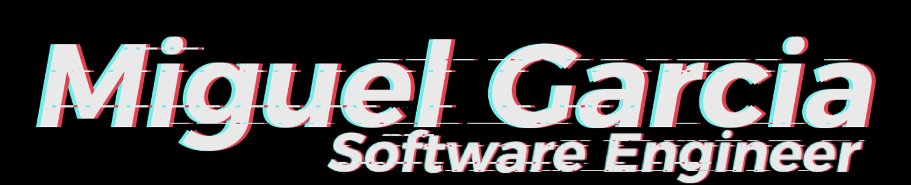

  <h3>shushuy.com</h3>
  

I'm a dedicated Software Engineer with over 10 years of experience in crafting accessible and inclusive products and digital experiences for both mobile and web platforms.

## About Me

With a strong background in mobile app and web development, I've spent the last 6 years focusing on creating solutions for companies in a range of industries including healthcare, consulting, retail, business networks, and government. I've had the privilege of collaborating with startups and big businesses across the US, Canada, and Latin America, helping them achieve their technological goals.

## Specializations

- **JavaScript**
- **TypeScript**
- **React JS**
- **React Native**
- **MySQL**
- **CSS**
- **Bootstrap**
- **Azure DevOps**
- **Circle CI**
- **Firebase**
- **Jest**
 

  <h3>Get in touch 🤝🏻</h3>
  
  

  <h3>
   <a href="https://shushuy.com/" target="_blank" rel="noopener noreferrer">
    shushuy.com
   </a>
  </h3>
    

